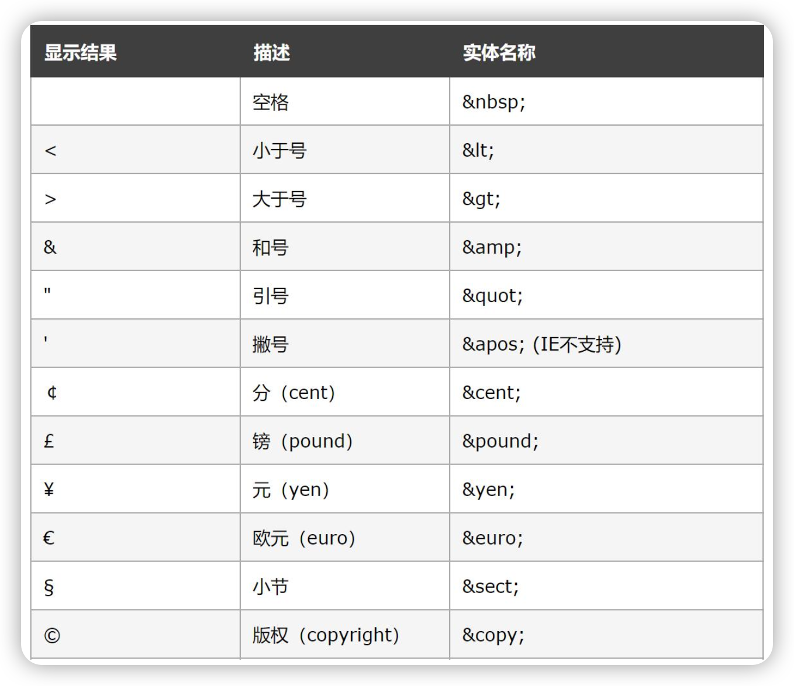

# HTML

html主要就是各种标签的框架组合，所以最主要学习的就是各种标签及其属性！

## 排版标签
```html
 <h1>这个是一级标题</h1>

    <!-- <hr> 是水平线标签 -->
    <hr>

    <h2>这个是二级标题，再往下还有h3-h6</h2>

    <p>这是一个段落标签，一般长段文字内容都是在这里书写</p>


    <!-- <br> 是一个换行标签 -->
    你好！！！<br>我是凡一
```

## 文本格式标签
```html
<b>加粗文字</b> <br>
<u>给文字加下划线</u> <br>
<i>让文字倾斜</i><br>
<s>给文字加删除线</s>
```


## 媒体标签

### 路径

**相对路径**

- 从盘符开始或者网络路径地址

**相对路径**


- 同级目录:
直接写文件名字即可 -- 快捷方式输入./即可选择图片

- 下级目录:
先进入目标文件所在的目录，然后一次向下选 -- 快捷方式./选择目标文件所在目录然后依次向下选

- 上级目录:
先确定目标文件所在的目录，然后../返回到目标文件目录依次向下选 -- 快捷键../ 选择目标文件所在目录然后依次向下选


### 图片标签
```html
 
```
- src 是音乐路径
- controls 是添加音乐控件，不添加不显示音乐
- autoplay 是打开网页自动播放音乐
- loop 是循环播放
- 音乐格式只支持mp3\wav\ogg


### 音乐标签
```html
<audio src="../mp3/沈明 - 走在冷风中.mp3" controls autoplay loop></audio>
```

- src 是音乐路径
- controls 是添加音乐控件，不添加不显示音乐
- autoplay 是打开网页自动播放音乐
- loop 是循环播放
- 音乐格式只支持mp3\wav\ogg


### 视频标签
```html
 <video src="../mp4/【励志】当你觉得撑不下去的时候，就来看看这条视频 - 001 - 1626167578223.mp4" controls autoplay muted loop width="500"></video>
```
- src 是视频的路径
- controls 是添加视频控件
- autoplay 是自动播放，但是为了保护用户隐私 需要配合muted实现静音自动播放
- loop 是循环播放
- 视频格式只支持mp4\webm\ogg


### 链接标签
```html
<a href="https://image.baidu.com" target="blank">百度图片</a>
```
- href 是要跳转的链接地址
- target 是链接打开方式 默认是_self在当前窗口打开覆盖原页面，blank是在新窗口打开

```html
<a href="#">回到顶部</a>
```
空链接：点击可会到顶部


## 列表标签
**无序列表**
ul代表无序列表的整体，li代表每个项
```html
<ul><h3>无序列表</h3>
    <li>苹果</li>
    <li>香蕉</li>
    <li>西瓜</li>
</ul>
```

**有序列表**
ol代表有序列表的整体，li代表每个项
```html
<ol><h3>有序列表</h3>
    <li>我是第一名</li>
    <li>我是第二名</li>
    <li>我是第三名</li>
</ol>
```

**自定义列表**
dl代表整体，dt代表主体，dd代表每一项
```html
<dl><h3>自定义列表</h3>
    <dt>帮助中心
        <dd>官方文档</dd>
        <dd>技术支持</dd>
        <dd>联系我们</dd>
    </dt>
    <dt>业务列表</dt>
        <dd>股票</dd>
        <dd>可转债</dd>
        <dd>基金</dd>
</dl>
```

## 表格标签

table表示表格整体，caption表示标题，tr表示每一行，td表示单元格，th表示表头单元格
table中的属性：border表示边框宽度，width表示表格宽度，height表示表格高度
表格结构标签：thead表示表格头部，tbody表示表格主体，tfoot表示表格底部
合并单元格：遵循左上原则，首先删除右下单元格，然后在坐上单元格标签添加属性
- rowspan 跨行合并
- colspan 夸列合并

```html
<table border="1" width="500" height="500">  
    <!-- border 边框熟悉 num是边框宽度 width是表格宽度 height是表格高度-->

    <!-- <caption> 表格的标题</caption> -->
    <caption><h3>信息表</h3></caption>

    <!-- thead表示表格头部 -->
    <thead>
            <!-- <tr>每一行</tr> -->
        <tr>
            <!-- <th>表头单元格</td> -->
            <th>姓名</th>
            <th>性别</th>
            <th>年龄</th>
        </tr>
    </thead>

    <!-- tbody表示表格主体 -->
    <tbody>
        <tr>
            <!-- <td>单元格</td> -->
            <td>凡一</td>
            <td>男</td>
            <td>18</td>
        </tr>
        <tr>
            <td>猪猪</td>
            <td rowspan="2">公</td>
            <td>21</td>
        </tr>
        <tr>
            <td>奥利奥</td>
            <!-- <td>公</td> -->
            <td>三个月</td>
        </tr>
    </tbody>

    <!-- tfoot表示表格底部 -->
    <tfoot>
        <tr>
            <td>评价</td>
            <td colspan="2">威武霸气</td>
            <!-- <td>16</td> -->
        </tr>
    </tfoot>
</table>
```


## 表单标签

### input标签
要使用表单按钮 需要用form包裹着所有的表单
```html
<form >
    <!-- <input type="text"> 文本框 placeholder是占位符-->
    姓名：<input type="text" placeholder="请输入姓名">
    <br><br>
    <!-- <input type="password"> 密码框-->
    密码：<input type="password" placeholder="请输入密码">
    <br><br>
    <!-- <input type="radio" 单选框 checked是默认选择> -->
    性别：<input type="radio" name="sex" checked>男
        <input type="radio" name="sex"> 女
    <br><br>
    <!-- <input type="checkbox"> 复选框 checked是默认选择-->
    爱好：<input type="checkbox"> 羽毛球
        <input type="checkbox" checked> 女
        <input type="checkbox"> 篮球
    <br><br>
    <!-- <input type="file"> 文件选择器-->
    请上传头像：<br><br>
    <input type="file">
    <br><br> 
    <!-- 按钮，三种类型 -->
    <input type="submit" value="提交资料">
    <input type="reset" value="重置">
    <input type="button" value="普通按钮">
</form>
```

### button标签
按钮标签
```html
<button type="submit">提交资料</button>
<button type="reset">重置</button>
<button type="button">普通按钮</button>
```

### select标签
下拉选择框
select是主体，option是每一项，selected是默认值
```html
<select >城市
    <option selected>北京</option>
    <option>天津</option>
    <option>上海</option>
</select>
```

### textarea标签
文本域标签
```html
<!-- <textarea cols=可见宽度 rows=可见行数></textarea> -->
<textarea cols="30" rows="10"></textarea>
```

### label标签
绑定内容和表单关系
```html
<label>
    <input type="radio"> 羽毛球
</label>
```


## 语义化标签
### 无语义标签
```html
<div>一行只有一个</div>
<span>一行可以有多个</span>
```
### 有语义标签
```html
<header>网页的头部</header>
<nav>网页导航</nav>
<footer>网页底部</footer>
<aside>网页侧边栏</aside>
<section>网页区块</section>
<article>网页文章</article>
```

## 字符实体



# CSS

## 基础认识

css 层叠样式表，主要是美化样式的，当给同一个标签设置相同样式，写在最下面的生效！

| 引入方式 | 书写位置                              | 作用范围 | 使用场景   |
| -------- | ------------------------------------- | -------- | ---------- |
| 内嵌式   | css写在style标签中                    | 当前页面 | 小案例     |
| 外链式   | 写在单独的css文件中，通过link标签引入 | 多个页面 | 项目中     |
| 行内式   | 写在标签的style属性中                 | 当前标签 | 配合js使用 |

## 基础选择器

选择页面中对应的标签（找到他），方便后续设置样式（改他）

| 选择器        | 结构                         | 作用                                           | 注意点                                                       |
| ------------- | ---------------------------- | ---------------------------------------------- | ------------------------------------------------------------ |
| 标签选择器    | 标签名{css属性名:属性值;}    | 通过标签找到页面中所有这类标签                 | 选择的是一类标签而不是一个                                   |
| 常用:类选择器 | .类名{css属性名:属性值;}     | 通过类名，找到页面中带有这个类名的标签         | class属性值称为类名<br>一个标签可以同时有多个类名（空格隔开）<br>类名可以重复，一个类选择器可以同时选中多个标签 |
| id选择器      | #id属性值{css属性名:属性值;} | 通过id属性值，找到页面中带有这个id属性值的标签 | id属性值是唯一的，只能有一个或选中一个                       |
| 通配符选择器  | *{css属性名:属性值;}         | 找到页面中所有的标签                           | 极少使用                                                     |


## 字体样式

| 字体样式     | 属性名      | 取值                                         | 注意点                                                  |
| ------------ | ----------- | -------------------------------------------- | ------------------------------------------------------- |
| 字体大小     | font-size   | 数字+px                                      | 一定要加单位，否则无效                                  |
| 字体粗细     | font-weight | 正常：normal<br>加粗：bold                   | 也可以使用100-900整百数                                 |
| 字体倾斜     | font-style  | 正常：normal<br>倾斜：italic                 | ---                                                     |
| 字体系列     | font-family | 具体字体1，具体字体2，具体字体3...，字体系列 | 具体字体如果是多个单词要加引号，字体系列不需要          |
| 行高         | line-height | 数字+px或者倍数                              | 让单行文本垂直居中可以设置 line-height : 文字父元素高度 |
| 字体font连写 | font        | style weight size/line-height family         | 主要顺序要求，如果要省略只可以省略前两个或line-height   |


## 文本样式

| 文本样式     | 属性名          | 取值                                                         | 注意点                                                      |
| ------------ | --------------- | ------------------------------------------------------------ | ----------------------------------------------------------- |
| 文本缩进     | text-indent     | 数字+em                                                      | 1em相当于一个字体大小                                       |
| 文本对齐方式 | text-align      | 左对齐：left<br>居中对齐：center<br>右对齐：right            | text-align属性是给所在标签也就是文本父元素设置              |
| 文本修饰     | text-decoration | 下划线：underline<br>删除线：line-through<br>上划线：overline<br>无装饰线：none | 开发中会使用 text-decoration : none ; 清除a标签默认的下划线 |
| 文字阴影     | text-shadow     | 必选，水平偏移值h-shadow<br>必选垂直偏移量v-shadow<br>可选，模糊度blur(0-1)<br>可选，阴影颜色color |                                                             |
| 大盒子居中   | margin:0 auto   | -                                                            | div、p、h(大盒子) 水平居中，直接给 当前元素本身 设置即可    |

```html
<!DOCTYPE html>
<html lang="en">
<head>
    <meta charset="UTF-8">
    <meta http-equiv="X-UA-Compatible" content="IE=edge">
    <meta name="viewport" content="width=device-width, initial-scale=1.0">
    <title>CSS</title>
    <style>
        /* 字体大小 */
        .dx{
            font-size: 30px;
        }

        .normal{
            font-weight: normal;
        }
        /* 字体加粗 */
        .bold{
            font-weight: bold;
        }
        /* 字体倾斜 */
        .italic{
            font-style: italic;
        }
        /* 修改字体 */
        .family{
            font-family: Cochin,黑体,sans-serif;
        }
        /* 字体样式连写 */
        .lx{
            font:italic bold 30px sans-serif;
        }
        /* 水平对齐方式 - 居中对齐 */
        .hz{
            text-align: center;
        }

        /* 添加缩进 */
        .sj{
            text-indent: 2em;
        }
        /* 下划线 */
        .underline{
            text-decoration: underline;
        }

        /* 删除线 */
        .scx{
            text-decoration: line-through;
        }

        /* 添加上划线 */
        .shx{
            text-decoration: overline;
        }
        /* 无衬线 */
        .none{
            text-decoration: none;
        }

        /* 居中 */
        .jz{
            width: 500px;
            height: 500px;
            background-color: #808080;
            /* 作用于大盒子div p h让其居中 */
            margin:0 auto
        }
        /* 行高 上下间距是（50-字体大小）/2 */
        .d1{
            line-height: 50px;
        }
        /* 行高 倍数 */  
        .d4{
            line-height: 5;
        }

    </style>
</head>
<body>
    <p class="dx">字体大小</p>
    <div class="normal">正常文字</div>
    <div class="bold">加粗的文字</div>
    <div class="italic">倾斜的文字</div>
    <h2>常见字体系列</h2>
        <h3>无衬线字体 sans-serif</h3>
        <h3>衬线字体</h3>
        <h3>等宽字体</h3>

        <div class="family">字体取值:具体字体1,具体字体2,具体字体3,具体字体4,...,字体系列</div>

    <h2>字体font连写</h2>
        <div class="lx">连写顺序：style weight size family</div>
    
    <h2>文本样式</h2>
        <div>这是一个正常的文本样式</div>
        <div class="sj">这是一个缩进的文本,数字em</div>


        <h3>文本修饰</h3>
        <div class="underline">添加下划线</div>
        <div class="scx">添加删除线</div>
        <div class="shx">添加上划线</div>
        <a href="#" class="none">百度一下</a>

    <div class="hz">
        我是一个文本
    </div>


    <div class="jz">一个盒子</div>


    <h2>行高</h2>
        <p class="d1">我是一行文字</p>
        <p class="d2">我是一行文字</p>
        <p>我是一行文字</p>
        <p class="d4">我是一行文字</p>

</body>
</html>
```

## 案例

[案例：新闻网页-效果图](./code/案例：新闻网页-效果图.html)

[案例：小米官卡片-效果图](./code/案例：小米官网卡片-效果图.html)

[案例：百度首页](./code/案例：百度首页.html)


## 选择器进阶

| 选择器     | 结构                 | 作用                                                         | 注意点                           |
| ---------- | -------------------- | ------------------------------------------------------------ | -------------------------------- |
| 后代选择器 | 选择器1 选择器2{css} | 根据HTML的嵌套关系，选择负元素后代中满足条件的元素           | 选择器之间空格隔开               |
| 子代选择器 | 选择器1>选择器2{css} | 根据HTML嵌套关系，选择父元素子代中满足条件的元素             | 子代之包括儿子                   |
| 并集选择器 | 选择器1,选择器2{css} | 同时选择多组标签，设置相同的样式                             | 并集选择器通常一行写一个         |
| 交集选择器 | 选择器1选择器2{css}  | (既又原则)找到页面中 既 能被选择器1选中，又能被选择器2选中的标签 | 如果有标签选择器必须写在最前面   |
| 伪类选择器 | 选择器:hover{css}    | 选中鼠标悬停上的状态                                         | 伪类选择器选中的是元素的某种状态 |

```html
<!DOCTYPE html>
<html lang="en">
<head>
    <meta charset="UTF-8">
    <meta http-equiv="X-UA-Compatible" content="IE=edge">
    <meta name="viewport" content="width=device-width, initial-scale=1.0">
    <title>Document</title>

    <style>
        /* 后代选择器 */
        div li{
            color: red;
        }
        /* 子代选择器 */
        div>p{
            color: aquamarine;
        }
        /* 并集选择器 */
        a,div p{
            font-size: 30px;
        }
        /* 交集选择器 */
        p#noe{
            text-align: center;
        }

    </style>
</head>
<body>
    <div class="red">
        <ul>
            <li>小标签</li>
            <li>小标签</li>
            <li>小标签</li>
            <p>小标签</p>
        </ul>
        <p>我是一个p标签</p>

    </div>

    <a href="#" id="bd"></a>

    <p id="noe">一个居中的p标签</p>

</body>
</html>
```


**enett语法**

| 记忆       | 示例                   | 效果                                                         |
| ---------- | ---------------------- | ------------------------------------------------------------ |
| 标签名     | div                    | &lt;div&gt;&lt;/div&gt;                                      |
| 类选择器   | .red                   | &lt;div class="red"&gt;&lt;/div&gt;                          |
| id选择器   | #one                   | &lt;div id="one"&gt;&lt;/div&gt;                             |
| 交集选择器 | p.red#one              | &lt;p class="red" id="one"&gt;&lt;/p&gt;                     |
| 子代选择器 | ul&gt;li               | &lt;ul&gt;&lt;li&gt;&lt;/li&gt;&lt;/ul&gt;                   |
| 内部文本   | ul&gt;li{我是一个文本} | &lt;ul&gt;&lt;li&gt;我是li内容&lt;/li&gt;&lt;/ul&gt;         |
| 创建多个   | li*3                   | &lt;li&gt;&lt;/li&gt;&lt;li&gt;&lt;/li&gt;&lt;li&gt;&lt;/li&gt; |


## 背景相关属性

| 相关属性     | 属性名                              | 属性值                                                       | 注意点                                                       |
| ------------ | ----------------------------------- | ------------------------------------------------------------ | ------------------------------------------------------------ |
| 背景颜色     | background-color                    | 关键字、rgb表示法、rgba表示法、十六进制                      | 背景颜色默认是透明的 fgba(0,0,0,0)                           |
| 背景图片     | background-image                    | url('图片路径')                                              | 背景图片默认水平和垂直方向平铺                               |
| 背景平铺     | background-repeat                   | 水平和垂直平铺:repeat<br>不平铺:no-repeat<br>水平平铺:repeat-x | 默认水平垂直平铺                                             |
| 背景位置     | background-position                 | 看下图                                                       | 方位名词取值和坐标取值可以混使用，第一个取值表示水平，第二个取值表示垂直 |
| 精灵图       | background-position                 | 取负值设置给盒子x y                                          |                                                              |
| 渐变背景     | background-image:linear-gradient{ } | 颜色1,颜色2,…                                                | 完全透明:transparent<br>透明颜色rgba(0,0,0,.5)               |
| 背景图片大小 | background-size                     | 宽度 高度<br>数字+px<br>百分比                               |                                                              |
| 背景连写     | background                          | color image repeat repeat position/size                      | 可以按照需求省略                                             |


```html
<!DOCTYPE html>
<html lang="en">
<head>
    <meta charset="UTF-8">
    <meta http-equiv="X-UA-Compatible" content="IE=edge">
    <meta name="viewport" content="width=device-width, initial-scale=1.0">
    <title>背景相关属性</title>
    <style>
        .class{
            width:800px;
            height:800px;
            background-color: red;
            background-image: url(../img/头像.jpg);
            background-repeat: no-repeat;
            background-position: 100px center;
        }

    </style>
</head>

<body>
    <div class="class"></div>

</body>
</html>
```


## 元素显示模式

| 属性                 | 效果                             | 特点                                             | 代表元素                                                     |
| -------------------- | -------------------------------- | ------------------------------------------------ | ------------------------------------------------------------ |
| display:block        | 转换成块元素                     | 独占一行，可以设置宽高                           | div、p、h系列、ul、li、dl、dt、dd、form、header、nav、footer...... |
| display:inline       | 一行可以显示多个，不可以设置宽高 | a、span 、b、u、i、s、strong、ins、em、del...... |                                                              |
| display:inline-block | 一行可以显示多个，可以设置宽高   | input、textarea、button、select......            |                                                              |

特殊情况:img标签有行内块元素特点，但是Chrome调试工具中显示结果是inline

**HTML嵌套规范注意点**

1. 块级元素一般作为大容器，可以嵌套:文本、块级元素、行内元素、行内块元素等等...... Ø 

   但是:p标签中不要嵌套div、p、h等块级元素

2. a标签内部可以嵌套任意元素 Ø 

   但是:a标签不能嵌套a标签


## CSS三大特性

### 继承性

子元素有默认继承父元素样式的特点(子承父业)

可以继承的常见属性:

```
1. color
2. font-style、font-weight、font-size、font-family 
3. text-indent、text-align
4. line-height
```

**继承失效的特殊情况**

```
如果元素有浏览器默认样式，此时继承性依然存在，但是优先显示浏览器的默认样式 

1. a标签的color会继承失效
    其实color属性继承下来了，但是被浏览器默认设置的样式给覆盖掉了 
    
2. h系列标签的font-size会继承失效
    其实font-size属性继承下来了，但是被浏览器默认设置的样式给覆盖掉了 

3. div的高度不能继承，但是宽度有类似于继承的效果
    宽度属性不能基继承，但是div有独占一行的特性

```

### 层叠性

**特性**

```
1. 给同一个标签设置不同的样式 → 此时样式会层叠叠加 → 会共同作用在标签上
2. 给同一个标签设置相同的样式 → 此时样式会层叠覆盖 → 最终写在最后的样式会生效
```

注意点:```当样式冲突时，只有当选择器优先级相同时，才能通过层叠性判断结果```


### 优先级

**特性**:

```不同选择器具有不同的优先级，优先级高的选择器样式会覆盖优先级低选择器样式```

**优先级公式**:

```继承 < 通配符选择器 < 标签选择器 < 类选择器 < id选择器 < 行内样式 < !important```

**注意点**

```
1. !important写在属性值的后面，分号的前面!
2. !important不能提升继承的优先级，只要是继承优先级最低! 3. 实际开发中不建议使用 !important 。
```


## 盒子模型

### 内容区域

```
作用:利用 width 和 height 属性默认设置是盒子 内容区域 的大小 
属性:width / height
常见取值:数字+px
```


###  边框

| 作用       | 属性名          | 属性值                                      |
| ---------- | --------------- | ------------------------------------------- |
| 边框粗细   | border-width    | 数字+px                                     |
| 边框样式   | border-style    | 实线：solid<br>虚线：dashed<br>点线：dotted |
| 边框颜色   | border-color    | 颜色取值                                    |
| 连写       | border          | width style color                           |
| 单方向设置 | border-方位名词 | 连写的取值                                  |


### 内边框

```
作用:设置 边框与内容区域之间的距离
属性名:padding
常见取值:如下表
```

| 取值   | 示例                        | 含义                                                |
| ------ | --------------------------- | --------------------------------------------------- |
| 一个值 | padding:10px                | 上下左右都设置为10px                                |
| 两个值 | padding:10px 20px           | 上下设置为10px 左右设置为20px                       |
| 三个值 | padding: 10px 20px 30px     | 上设置为10px 左右设置为20px 下设置为30px            |
| 四个值 | padding:10px 20px 30px 40px | 上设置为10px 右设置为20px 下设置为30px 左设置为40px |

记忆规则：**从上开始赋值，然后顺时针赋值，如果没有赋值的，看对面的！！！**

```
单个方向设置内边框：padding-方位名词
```


### 外边框

```
作用:设置边框以外，盒子与盒子之间的距离
属性名:margin
常见取值:与内边框padding一样
单方向设置：与内边框padding一样
```

**margin单方向设置的应用**

| 方向     | 属性          | 效果               |
| -------- | ------------- | ------------------ |
| 水平方向 | margin-left   | 让当前盒子往右移动 |
| 水平方向 | margin-right  | 让右边盒子往右移动 |
| 垂直方向 | margin-top    | 让当前盒子往下移动 |
| 垂直方向 | margin-bottom | 让下面盒子往下移动 |

**清除默认内外边框**

浏览器会默认给部分标签设置默认的margin和padding，但一般在项目开始前需要先清除这些标签默认的 margin和padding，后续自己设置

解决办法：淘宝

优点：运行效率高，缺点添加时候相对麻烦！


解决办法：京东

优点：添加时候相对简单，缺点运行时候相对效率低


**盒子阴影**

属性名：box-shadow

| 参数     | 作用                       |
| -------- | -------------------------- |
| h-shadow | 必须，水平偏移量，允许负值 |
| v-shadow | 必须，垂直偏移量，允许负值 |
| blur     | 可选，模糊度 0-1           |
| spread   | 可选，阴影扩大             |
| color    | 可选，阴影颜色             |
| inset    | 可选，将阴影改为内部阴影   |


### 实际盒子大小

```
盒子宽度 = 左边框 + 左padding + 内容宽度 + 右padding + 右边框
盒子高度 = 上边框 + 上padding + 内容宽度 + 下padding + 下边框
```

**当盒子被border和padding撑大后如何满足需求**

```
手动内减：按照计算的值手动修改width和height的值
自动内减：给盒子设置属性box-sizing:border-box
```

### 案例

[新浪首页](./code/%E6%A1%88%E4%BE%8B%EF%BC%9A%E6%96%B0%E6%B5%AA%E9%A6%96%E9%A1%B5.html)
[网页新闻列表](./code/%E6%A1%88%E4%BE%8B%EF%BC%9A%E7%BD%91%E9%A1%B5%E6%96%B0%E9%97%BB%E5%88%97%E8%A1%A8.html)
[宠物知识](./code/案例：爱宠知识新闻案例.html)


## 选择器

### 结构伪类选择器

**作用与优势**

- 作用：根据元素在html中的结构关系查找元素
- 优势：减少对html中类的依赖，有利于保持代码的 整洁
- 场景：常用于查找某父级选择器中的子元素

**选择器**

| 选择器                  | 说明                                     |
| ----------------------- | ---------------------------------------- |
| E:first-child { }       | 匹配父元素中第一个子元素，并且是E元素    |
| E:last-child { }        | 匹配父元素中最后一个子元素，并且是E元素  |
| E:nth-child(n) { }      | 匹配父元素中第n个子元素，并且是E元素     |
| E:nth-last-child(n) { } | 匹配父元素中倒数第n个子元素，并且是E元素 |
| E:nth-of-type(n){ }     | 只在父元素同类E子元素范围中，匹配第n个   |

**关于n的注意点**

n为：0、1、2、3、4、5、……

通过n可以组成常见的公式

| 功能             | 公式      |
| ---------------- | --------- |
| 偶数             | 2n、even  |
| 奇数             | 2n-1、odd |
| 找到前五个       | -n+5      |
| 找到从第五个往后 | n+5       |


### 链接伪类选择器

常用于选中超链接的不同状态

| 选择器语法   | 功能                        |
| ------------ | --------------------------- |
| a:link{ }    | 选中a链接伪访问过的状态     |
| a:visited{ } | 选中a链接访问过之后的的状态 |
| a:hover{ }   | 选中鼠标悬停的状态          |
| a:active{ }  | 选中鼠标按下的状态          |

如果需要同时实现以上四种伪类状态效果，需要按照 LVHA 顺序书写


### 焦点伪类选择器

用于选中元素获取焦点时状态，常用于表单控件

| 语法           | 效果                                   |
| -------------- | -------------------------------------- |
| Input:focus{ } | 表单控件获取焦点时默认会显示外部轮廓线 |


### 属性选择器

通过元素上的html属性来选择元素，常用于选择input标签

| 选择器        | 功能                                    |
| ------------- | --------------------------------------- |
| E[attr]       | 选择具有9欧attr属性的E元素              |
| E[attr="val"] | 选择具有attr属性并且属性值等于val的元素 |


## 浮动

浮动主要是用于网页布局：让垂直布局的盒子变成水平布局

| 属性名      | 效果   |
| ----------- | ------ |
| float:left  | 左浮动 |
| float:right | 右浮动 |

**浮动的特点**

- 浮动元素会脱离标准流，在标准流中不占位置
- 浮动元素比标准流高半个级别，可以覆盖标准流中的元素
- 浮动找浮动，下一个浮动元素会在上一个浮动元素后面左右浮动
- 浮动元素会收到上面元素边界的影响
- 浮动元素有特殊的显示效果
  - 一行可以显示多个
  - 可以设置宽高
- 浮动的元素不能通过text- align:center或margin:0 auto，让浮动元素本身水平居中

**清除浮动**

如果子元素浮动了，此时子元素不能撑开标准流的块级父元素，我们需要父元素有高度，从而不影响其他网页的元素布局

| 方法               | 操作                                                         | 优点                                   | 缺点                                       |
| ------------------ | ------------------------------------------------------------ | -------------------------------------- | ------------------------------------------ |
| 直接设置父元素高度 | 直接给父元素设置固定高度                                     | 简单粗暴、方便                         | 高度会固定，有些场景不适合                 |
| 额外标签法         | 在父元素内部的最后添加一个块级元素<br>给添加的块级元素设置clear:both | 高度不固定                             | 会在页面中添加额外的标签，让html结构变复杂 |
| 单伪元素清除法     | 用伪元素替代额外标签<br>.clearfix::after{content:'';display:block; clear:both}<br>给需要清除的标签添加类名clearfix | 项目中使用，直接给标签价类即可清除浮动 |                                            |
| 双伪元素清除法     | .clearfix::before,.clearfix::after{content:'';display:table;}<br>.clearfix::after{clear:both} | 额外还可以清除塌陷现象                 |                                            |
| overflow:hidden    | 给父元素设置overflow:hidden                                  | 方便，可清除塌陷                       |                                            |


## 定位

可以解决盒子与盒子之间的层叠问题，可以让那个盒子始终固定在屏幕中的某个位置！

### **定位方式**

| 定位方式 | 属性名:值         | 说明                                                         |
| -------- | ----------------- | ------------------------------------------------------------ |
| 静态定位 | positon:static    | 静态定位就是之前标准流，不能通过方位属性进行移动             |
| 相对定位 | position:relative | 相对于自己原来位置进行移动<br>在页面中占位置——没有脱标       |
| 绝对定位 | positon:absolute  | 默认相对于浏览器可视区域进行移动<br>在页面中不占位置——已经脱标<br>如果祖先元素中有定位——相对于最近有定位的祖先元素移动 |
| 固定定位 | position:fixed    | 相对于浏览器可视区域进行定位移动<br>在页面中不占位置——已经脱标 |

**偏移值**

偏移值设置氛围两个方向，水平和垂直方向各选一个实验即可，一般就近原则

| 方向 | 属性名 | 属性值  | 含义           |
| ---- | ------ | ------- | -------------- |
| 水平 | left   | 数字+px | 距离左边的距离 |
| 水平 | right  | 数字+px | 距离右边的距离 |
| 垂直 | top    | 数字+px | 距离上边的距离 |
| 垂直 | bottom | 数字+px | 距离下边的距离 |

### **子绝父相**

让子元素相对于父元素进行自由移动，父元素是相对定位，对网页布局影响最小，子元素是绝对定位！

在使用子绝父相的时候，发现父元素已经有绝对定位了，此时直接子绝即可!

水平垂直居中方法：

2. left:50%;
3. top:50%;
4. transform:translate(-50%，-50%);

### **元素层级问题**

场景:改变定位元素的层级

属性名:z-index

属性值:数字（数字越大，层级越高）


## 装饰

### 垂直对齐方式

基线：浏览器文字类型的元素排版中存在用于对齐的基线


**作用**

1. 文本框和表单按钮无法对齐问题
2. input和img无法对齐问题
3. div中的文本框，文本框无法贴顶问题
4. div不设置高度由img标签撑开，此时img标签下面会存在的额外间隙问题
5. 使用line-height让img标签垂直居中问题

| 属性名:值               | 效果           |
| ----------------------- | -------------- |
| Vertical-aling:baseline | 默认，基线对齐 |
| vertical-align:top      | 顶部对齐       |
| vertical-align:middle   | 中部对齐       |
| vertical-align:bottom   | 底部对齐       |


### 光标类型

设置鼠标光标在元素上时显示的样式

| 属性名:值      | 效果                         |
| -------------- | ---------------------------- |
| cursor:default | 默认值，通常是箭头           |
| cursor:pointer | 小手效果，提示用户可以点击   |
| cursor:text    | 工字型，提示用户可以选择文字 |
| cursor:move    | 十字光标，提示用户可以移动   |


### 边框圆角

让盒子四个角变得圆润，增加页面细节，提升用户体验

| 属性名        | 取值            | 赋值规则                                             |
| ------------- | --------------- | ---------------------------------------------------- |
| border-radius | 数字+px、百分比 | 从左上角开始复制，然后顺时针赋值，没有赋值的看对角！ |

画一个正圆：盒子必须是正方形，设置边框圆角为盒子宽高的一半：border-radius:50%

胶囊按钮：盒子必须是长方形，设置border-radius:盒子高度的一半


### overflow溢出部分显示效果

指的是盒子内容部分所超出盒子范围的区域

| 属性名:值        | 效果                               |
| ---------------- | ---------------------------------- |
| overflow:visible | 默认值，溢出部分可见               |
| overflow:hidden  | 溢出部分隐藏                       |
| overflow:scroll  | 无论是否溢出，都显示滚动条         |
| overflow:auto    | 根据是否溢出，自动显示或隐藏滚动条 |


### 元素本身隐藏/显示

让某元素本事在屏幕中不可见，如鼠标hover之后元素隐藏

| 属性名:值         | 效果         | 区别             |
| ----------------- | ------------ | ---------------- |
| visibility:hidden | 隐藏元素本身 | 在网页中占位置   |
| display:none      | 隐藏元素本身 | 在网页中不占位置 |
| display:block     | 显示元素     |                  |


### 边框合并

让相邻边框进行合并，得到细线边框效果

代码：border-collapse:collapse


### 过渡

让元素的样式慢慢的变化，常配合hover使用，增强网页交互体验

属性名：transition

| 参数       | 取值                                                         |
| ---------- | ------------------------------------------------------------ |
| 过度的属性 | all：所有能过渡的属性都过渡<br>具体属性名如Lwidth：只给width过渡 |
| 过度的时长 | 数字+s（秒）                                                 |

**注意点**

1. 过渡需要:默认状态 和 hover状态样式不同，才能有过渡效果

2. transition属性给需要过渡的元素本身加

3. transition属性设置在不同状态中，效果不同的

   1 给默认状态设置，鼠标移入移出都有过渡效果
    2 给hover状态设置，鼠标移入有过渡效果，移出没有过渡效果


### SEO三大标签

1. title:网页标题标签
2. description:网页描述标签 
3. keywords:网页关键词标签


### ico图标设置


### 版心

场景:把页面的主体内容约束在网页中间
作用:让不同大小的屏幕都能看到页面的主体内容 

代码:需要给设置类属性container

```css
.container{
    width:1240px;
    margin: 0 auto;
}
```


### 字体图标

**优点**：

- 灵活性:灵活地修改样式，例如:尺寸、颜色等 
- 轻量级:体积小、渲染快、降低服务器请求次数 
- 兼容性:几乎兼容所有主流浏览器
- 使用方便:
  1. 下载字体包 
  2. 使用字体图标

[图标库：iconfont](https://www.iconfont.cn/)


**上传下载字体图标**

登录 → 选择图标库/上传字体图标 → 选择图标，加入购物车 → 购物车 → 添加至项目 → 下载至本地

**使用字体图标—类名**

加下载项目重命名iconfont → 复制到项目根目录下 → 引入字体图标→调用图标对应的类名，必须调用2个类名

```html
<!-- 引入字体图标方法： -->
<link rel="stylesheet" href="../iconfont/iconfont.css">

<!-- 调用字体图标： -->
<span class="iconfont icon-shouye"></span>
<!-- iconfont类:基本样式，包含字体的使用等  icon-xxx:图标对应的类名-->
```


## 平面转换

平面转换：改变盒子在平面内的形态(位移、旋转、缩放) 2D转换

平面转换属性：transform

| 功能     | 语法                             | 取值                                                         | 技巧                                                         |
| -------- | -------------------------------- | ------------------------------------------------------------ | ------------------------------------------------------------ |
| 位移     | transform:translate(x参数 y参数) | 像素单位数值<br>百分比(参照物为盒子自身之村)                 | tranlateX()单独设置一个方向                                  |
| 旋转     | transform:rotate(角度)           | 角度（数值deg）                                              | 取值为正是顺时针选装                                         |
| 缩放     | transform:scale(x倍数 y倍数)     | 缩放倍数                                                     | transform: scale(缩放倍数);<br/> scale值大于1表示放大, scale值小于1表示缩小 |
| 转换原点 | transform-origin(x y)            | 默认盒子中心点<br>方为名词(left\top\right\bottom\center)<br>像素单位数值、百分比 |                                                              |


## 空间转换

空间:是从坐标轴角度定义的。 x 、y 和z三条坐标轴构成了一个立体空间，z轴位置与视线方向相同。 

空间转换也叫3D转换

**属性:transform**

| 作用     | 语法                                                         | 取值               | 技巧                                                         |
| -------- | ------------------------------------------------------------ | ------------------ | ------------------------------------------------------------ |
| 空间平移 | transform: translate3d(x, y, z);<br> transform: translateX(值);<br/>transform: translateY(值);<br/>transform: translateZ(值); | 单位数值<br>百分比 | 需要给父级添加perspective:800-1200px                         |
| 空间旋转 | transform:rotateX(值)<br>transform:rotateY(值)<br/>transform:rotatey(值) | 角度(数值deg)      | 左手法则判断旋转方向: 左手握住旋转轴, 拇指指向正值方向, 手指弯曲方向为旋转正值方向<br>给父级添加 transform-style: preserve-3d; Ø 使子元素处于真正的3d空间 |
|          |                                                              |                    |                                                              |

 

## 动画

**属性：animation,动画过程可控(重复播放、最终画面、是否暂停等)**


**定义动画**

```css
<!-- 第一种定义方法：两个状态之间变化 -->
@keyframes 动画名称 {
    from{ } # 动画开始时候的状态，如果与初始状态相同可以省略
    to { } # 动画执行的状态
}

<!-- 第二种定义方法：多个状态之间变化 -->
@keyframes 动画名称 {
    0%{ }
    10%{ }
    50% { }
    100% { }
}
<!-- %指的是所占动画执行时间的百分比-->
```

**使用动画—连写**

```css
animation: 动画名称 动画时长 速度曲线 延迟时间 重复次数 动画方向 执行完毕时状态;

<!-- 注意点 -->
动画名称和动画时长必须赋值
取值不分先后顺序
如果有两个时间值，第一个时间表示动画时长，第二个时间表示延迟时间
```

**动画属性—拆分**

| 属性                      | 作用               | 取值                                                      |
| ------------------------- | ------------------ | --------------------------------------------------------- |
| animation-name            | 动画名称           | 英文                                                      |
| animation-duration        | 动画时长           | 数字s                                                     |
| animation-delay           | 延迟时间           | 数字s                                                     |
| animation-fill-mode       | 动画执行完毕时状态 | 默认backwards:第一帧状态<br>forwards:最后一帧状态         |
| animation-timing-function | 速度曲线           | 默认：补间动画<br>steps(数字):逐帧动画<br>linear:匀速运动 |
| animation-iteration-count | 重复次数           | 数字<br>infinite:无限循环                                 |
| animation-direction       | 动画之行方向       | alternate为反向                                           |
| animation-play-state      | 暂停动画           | paused为暂停，通常配合hover使用                           |


## CSS书写顺序

**不同的CSS书写顺序会影响浏览器的渲染性能**

| 顺序 | 类别          | 属性                                                  |
| ---- | ------------- | ----------------------------------------------------- |
| 1    | 布局属性      | display、position、float、clear、visibility、overflow |
| 2    | 盒子模型+背景 | width、height、margin、padding、border、background    |
| 3    | 文本内容属性  | color、font、text-decoration、text-align、line-height |
| 4    | 点缀属性      | cursor、border-radius、text-shadow、box-shadow        |

**注意点**：开发中推荐**多用类 + 后代**，但不是层级越多越好，一个选择器中的类选择器的个数推荐 不要超过 3 个

