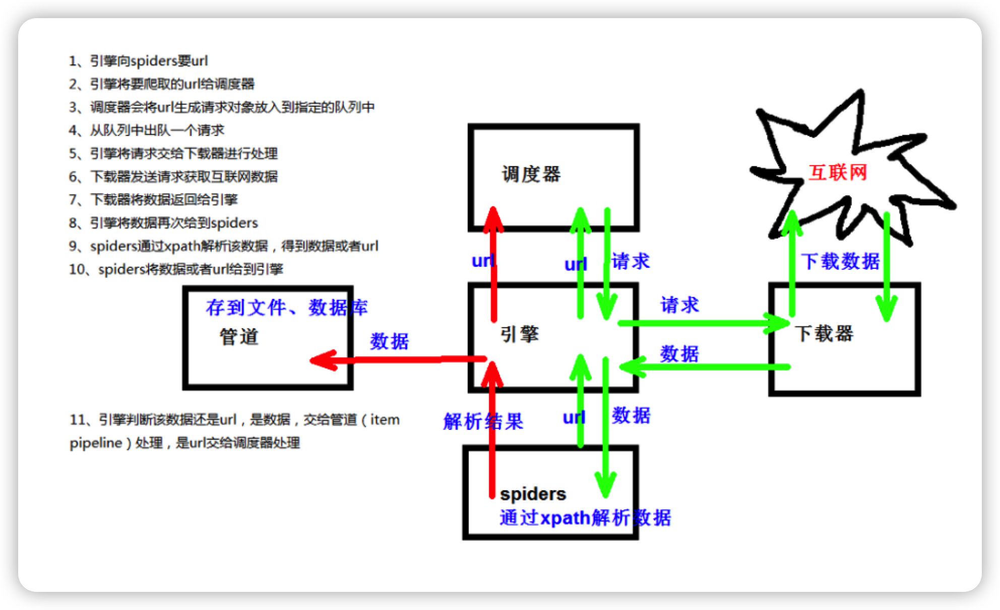
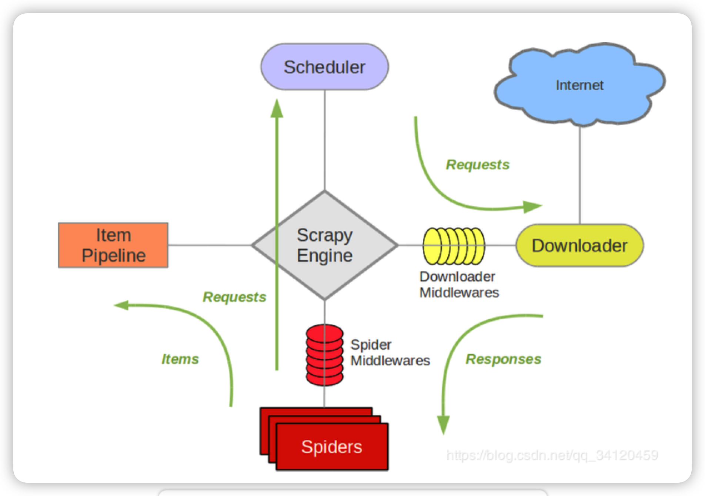

# 爬虫基本逻辑使用

使用程序模拟浏览器，去向服务器发送请求，获取有用数据信息！


## 爬虫的核心

```
爬取网页：爬取整个网页、包含子网页中所有的信息
解析数据：将网页中得到的数据进行解析
难点：爬虫和反爬虫之间的博弈
```


## 爬取网页

### requests基本使用

**安装requests**

```
进入到python文件目录下
pip install requests
```

###  

**文档说明：**

[官方文档](https://docs.python-requests.org/zh_CN/latest/)、[快速上手](https://docs.python-requests.org/zh_CN/latest/user/quickstart.html)


**基本语法**

| 类型          | 功能                  |
| ------------- | --------------------- |
| r.get         | get —模拟浏览器访问   |
| r.post        | post — 模拟浏览器访问 |
| r.text        | 获取网站源码          |
| r.encoding    | 访问或定制编码方式    |
| r.url         | 获取请求的url         |
| r.content     | 响应的字节类型        |
| r.status_code | 响应的状态码          |
| r.headers     | 响应的头信息          |


### get请求


```python
# 导入requests
import requests


# 获取请求地址
url_1 = 'https://www.baidu.com/s?wd=%周杰伦' # 完整的请求地址

url_2 = 'https://www.baidu.com/s?' # 缺少参数的请求地址,具体看实际需求
data = {'wd':'周杰伦'}


# 获取请求头
headers = {
    'User-Agent': 'Mozilla/5.0 (Macintosh; Intel Mac OS X 10_15_7) AppleWebKit/537.36 (KHTML, like Gecko) Chrome/100.0.4896.60 Safari/537.36'
}


# 模拟浏览器访问
response = requests.get(url=url,params=data,headers=headers) # 如果没有data可以不传入params
```


### post请求


```python
# eg:百度翻译

# 导入requests
import requests


# 获取请求地址
url = 'https://fanyi.baidu.com/sug'
data = {'kw':'love'} -- 传递的参与，love可以是其他变量单词


# 获取请求头
headers = {
    'User-Agent': 'Mozilla/5.0 (Macintosh; Intel Mac OS X 10_15_7) AppleWebKit/537.36 (KHTML, like Gecko) Chrome/100.0.4896.60 Safari/537.36'
}


# 模拟浏览器访问
response = requests.post(url=url,data=data,headers=headers) 
```


###  get请求和post请求的区别

| 请求方式 | 编码         | 参数                 | encode调用       |
| -------- | ------------ | -------------------- | ---------------- |
| get      | 参数必须编码 | 拼接到url之后        | 不需要encode调用 |
| psot     | 参数必须编码 | 参数是放在对象定制中 | 需要encode调用   |


### cookie定制

cookie会记住我们的数据信息，然后当特定用户登入会进行数据交换，如果涉及到登陆的爬虫则需要用到cookie定制

cookie请求一般请求数据会带在post请求里面，所以原理和post请求一样，一般我们登陆时候故意输错密码，然后数据文件中一般会有一个名为logxxxxx的文件里面携带表单数据


```python
data={
  	'__VIEWSTATE':'La4Z9fymCBZt4ZHrRdLLDWklr0MKTC4cScOjB1ZCb5bMUsj1YhjXSC16yT0d0WCEjcUSZ/NHtSeFEB9KRT5hF1XoJ/RW1m0/GGAvsdAaSY5MNWgmSgMmC8eWWKc='
    '__VIEWSTATEGENERATOR': 'C93BE1AE'
    'from': 'http://so.gushiwen.cn/user/collect.aspx'
    'email': '15389552031'
     'pwd': 'sdasdasdsa'
    'code': 'xoat'
    'denglu': '登录'
}
# 然后将data传入requests.post()中


# 其中email\pwd是我们自己输入的账号密码，denglu 是登陆 -- 都是固定的
# '__VIEWSTATE'和'__VIEWSTATEGENERATOR'是变动的需要在每次登陆页面的源码中获取 -- xpath
# code 也是在每次登陆中获取 -- 可以通过超级鹰自动验证码识别
```


### 验证码识别

超级鹰


### 代理

可以在请求中设置proxies参数传入代理IP即可，参数类型是一个字典类型

```python
# 导入随机库
import random


# 设置代理池 -- 池中的单个代理也是字典类型
proxies_s = {
    {'http':'219.149.59.250:9797'},
    {'http':'219.149.59.250:9797'},
    {'http':'219.149.59.250:9797'},
    {'http':'219.149.59.250:9797'},
}


# 随机获取一个代理
proxies = random.choice(proxoes_s)
```


## 解析数据

### HTML解析 — Xpath


#### Xpath安装

**Xpath插件安装**

```
浏览器插件搜索XPath Helper
安装到扩展程序中
重启浏览器
调用方法：ctrl+shift+X -- 出现小黑框就可以使用了
```

**lxml库安装**

```python
pip install lxml 

pip install lxml ‐i https://pypi.douban.com/simple # 国内源
```


#### 调用解析

```python
# 导入lxml.etree
from lxml import etree


# 解析本地文件
tree = etree.parse('xx.html')


# 解析服务器响应文件
tree = etree.HTML('xx.html')


# xpath查询
tree.xpath('xpath路径')
```


#### 节点定位

**演示案例**

```html
<!DOCTYPE html>
<html lang="en">
<head>
    <meta charset="UTF-8"/>
    <title>Title</title>
</head>
<body>
    <ul>
        <li id="l1" class="c1">北京</li>
        <li id="l2">上海</li>
        <li id="c3">深圳</li>
        <li id="c4">武汉</li>
    </ul>

    <li>山东</li>
    <li id="5c">辽宁</li>
    <li>西安</li>

</body>
</html>
```

| 语法                         | 功能                               | 实例                                     | 结果                               |
| ---------------------------- | ---------------------------------- | ---------------------------------------- | ---------------------------------- |
| //                           | 查找所有的子孙节点，不考虑层级关系 | tree.xpath('//body//li')                 | 返回七个li标签                     |
| /                            | 查找直接子节点                     | tree.xpath('//body/ul/li')               | 返回北京、上海、深圳、武汉的li标签 |
| //div[@属性]                 | 查询包含某个属性的节点             | tree.xpath('//li[@id]')                  | 返回北京、上海、深圳、武汉的li标签 |
| //div[@属性=“xxxxxx”]        | 查询符合这个属性值的节点           | tree.xpath('//li[@class="c1"]')          | 返回北京的li标签                   |
| //div[contains(@属性,”xx”)]  | 查询属性值中包含xx的节点           | Tree.xpath(''//li[contains(@id,"c")]')   | 返回深圳、武汉、辽宁所在标签       |
| //div[starts-with(@id,”xx”)] | 查询属性值中以xx开头的节点         | tree.xpath('//li[starts-with(@id,"c")]') | 返回深圳、武汉所在标签             |


#### 节点信息

演示案例同节点定位

| 语法    | 功能               | 实例                              | 结果                             |
| ------- | ------------------ | --------------------------------- | -------------------------------- |
| /text() | 获取文本内容       | tree.xpath('//body/ul/li/text()') | ['北京', '上海', '深圳', '武汉'] |
| /@属性  | 获取属性所对应的值 | tree.xpath('//body/ul/li/@id')    | ['l1', 'l2', 'c3', 'c4']         |


### JSON解析 — JsonPath

[教程说明](http://blog.csdn.net/luxideyao/article/details/77802389)


#### JsonPath安装

```
pip install jsonpath
```


#### 调用解析

```python
# 导入json库
import json
import jsonpath


# 获取json文件 -- 只可以解析本地文件
obj = json.load(open('路径.json','r',encodeing='utf-8'))


# json节点查询
ret = jsonpath.jsonpath(obj,'jsonpath语法')
```


#### jsonpath解析语法

**演示案例**

```json
{ "store": {
    "book": [
      { "category": "修真",
        "author": "六道",
        "title": "坏蛋是怎样练成的",
        "price": 8.95
      },
      { "category": "修真",
        "author": "天蚕土豆",
        "title": "斗破苍穹",
        "price": 12.99
      },
      { "category": "修真",
        "author": "唐家三少",
        "title": "斗罗大陆",
        "isbn": "0-553-21311-3",
        "price": 8.99
      },
      { "category": "修真",
        "author": "南派三叔",
        "title": "星辰变",
        "isbn": "0-395-19395-8",
        "price": 22.99
      }
    ],
    "bicycle": {
      "author": "老马",
      "color": "黑色",
      "price": 19.95
    }
  }
}
```

**解析语法**

| 语法 | 功能                         | 案例                                                         | 结果                                                         |
| ---- | ---------------------------- | ------------------------------------------------------------ | ------------------------------------------------------------ |
| $    | 表示根元素，一般起始都会写   | -                                                            | -                                                            |
| *    | 通配符，表示所有元素         | jsonpath.jsonpath(obj,'$..*')                                | 返回根元素下所有元素                                         |
| ..   | 递归下降，该元素下的子孙元素 | jsonpath.jsonpath(obj,'$.store..price')                      | 返回store下所有的price                                       |
| [ ]  | 子元素操作符                 | jsonpath.jsonpath(obj,'$..book[2]')                          | 返回第三本书                                                 |
| ?( ) | 过滤                         | jsonpath.jsonpath.(obj,'&..book[?(@.isbn)]')<br />jsonpath.jsonpath(obj,'$..book[?(@.price>10)]') | 返回所有书中包含isbn的元素<br />返回所有书中price大于10的元素 |


## 下载数据


### 下载二进制文件

```python
import requests


# 二进制文件地址
url = 'https://www.keaidian.com/uploads/allimg/190424/24110307_35.jpg'


# 转为二进制文件
r = requests.get(url).content


# 下载 -- w后面加b写入的是二进制
with open('imp.jpg','wb') as f:
	f.write(r)
```


### 写入文本

```python
text = '文本内容'


# w是覆盖写入，a是在文本中追加
with open('filename.md','w',encoding='utf-8') as f: 
    f.write(text)
```

# Scrapy爬虫工具

Scrapy是一个为了爬取网站数据，提取结构性数据而编写的应用框架。 可以应用在包括数据挖掘，信息处理或存储历史数据等一系列的程序中


## 安装scrapy

```
pip install scrapy

安装过程中出错:

如果安装有错误!!!!
pip install Scrapy
building 'twisted.test.raiser' extension
error: Microsoft Visual C++ 14.0 is required. Get it with "Microsoft Visual C++
Build Tools": http://landinghub.visualstudio.com/visual‐cpp‐build‐tools 
解决方案:
http://www.lfd.uci.edu/~gohlke/pythonlibs/#twisted 下载twisted对应版本的whl文件(如我的Twisted‐17.5.0‐cp36‐cp36m‐win_amd64.whl)，cp后面是
python版本，amd64代表64位，运行命令:
pip install C:\Users\...\Twisted‐17.5.0‐cp36‐cp36m‐win_amd64.whl pip install Scrapy


如果再报错
python ‐m pip install ‐‐upgrade pip 

如果再报错 win32
解决方法:
pip install pypiwin32 

再报错:使用anaconda
使用步骤: 打开anaconda
点击environments
点击not installed
输入scrapy
apply 在pycharm中选择anaconda的环境
```


## 创建scrapy项目

考虑到未知多页下载的需求，这里借用CrawlSpider，除了网页构建不同其他基本相同

本次演示以电影天堂国内电影区为例：https://www.ygdy8.net/html/gndy/china/list_4_1.html

```python
# 终端 -- 进入到需要创建的爬虫文件夹下
cd 爬虫文件夹路径


# 终端 -- 创建scrapy项目
scrapy startproject 项目名称 # 不能数字开头


# 终端 -- 跳转到spiders文件夹，创建爬虫文件
cd 目录名字/目录名字/spiders
scrapy genspider ‐t crawl 爬虫名字 网页的域名
scrapy genspider ‐t crawl 


# 终端 -- 运行爬虫文件方法
scrapy crawl 爬虫名称
```


**创建的爬虫项目目录如下**

```python
├── scrapy.cfg # 项目配置文件
└── 项目名称 # 项目python模块, 之后将在此加入代码 -- 我这里创建的名为movie，后面演示将用movie
    ├── __init__.py
    ├── items.py # 项目items文件
    ├── pipelines.py # 项目管道文件
    ├── settings.py # 项目配置文件
    └── spiders # 放置spider的目录
        └── __init__.py
        └── 自己创建的爬虫文件.py # 我这里创建的名为md，后面演示将用md
```


## scrapy工作原理






## 网页请求解析数据

创建好项目之后进入python爬虫项目，打开spiders，进入创建的爬虫文件，我这里名为md

本次演示地址：https://www.ygdy8.net/html/gndy/china/list_4_1.html


### 校验文件修改配置

**首先进入md文件调整检验项目可以正常运行**

```python
import scrapy
from scrapy.linkextractors import LinkExtractor
from scrapy.spiders import CrawlSpider, Rule


class MdSpider(CrawlSpider):
    name = 'md' # 项目名字
    allowed_domains = ['www.ygdy8.net'] # 允许访问的地址 -- 这里只包含域名
    start_urls = ['https://www.ygdy8.net/html/gndy/china/list_4_1.html'] # 声明一个起始地址 -- 修改成具体请求地址

    rules = (
        Rule(LinkExtractor(allow=r'https://www.ygdy8.net/html/gndy/china/list_4_\d+.html'), callback='parse_item', follow=True),
    ) # 正则获取所有页，编写allow规则

    def parse_item(self, response): # 输入print()运行文件查询是否可以正常运行
        print('============================')
        

# 终端 -- 爬虫文件运行
scrapy crawl md
```

**如果正常运行则进入下一步，不可以正常运行则进入settings将ROBOTSTXT_OBEY = True注释掉**

```python
# ROBOTSTXT_OBEY = True
```


### 解析数据

本次请求获取https://www.ygdy8.net/html/gndy/china/list_4_1.html的电影名及子页面的图片，获取全部页面

```python
# md.py文件

from movie.items import MovieItem # 导入items


    def parse_item(self, response): # 输入print()运行文件查询是否可以正常运行
        # print('============================')
        # name = response.xpath('//div[@class="co_content8"]//td[2]//a[2]/text()')
        # href = response.xpath('//div[@class="co_content8"]//td[2]//a[2]/@href')

        a_list = response.xpath('//div[@class="co_content8"]//td[2]//a[2]')

        for a in a_list:
            # 获取第一页的name 和 要点击的链接
            name = a.xpath('./text()').extract_first()
            href = a.xpath('./@href').extract_first()


            url = 'https://www.ygdy8.net' + href # 拼接图片页请求地址

            # 访问parse_second，同时将name和state传入
            yield scrapy.Request(url=url,callback=self.parse_second,meta={'name':name})


    def parse_second(self,response): # 模仿parse_item()

        # src = response.xpath('//div[@class="co_content8"]//img/@src').extract_first() # 获取图片地址
        src = response.xpath('//div[@id="Zoom"]//img/@src').extract_first()
        name = response.meta['name'] # 接收传来的name


        movie = MovieItem(name=name,src=src) # 传入items

        yield movie 
```


## 传到items

```python
# items.py

# Define here the models for your scraped items
#
# See documentation in:
# https://docs.scrapy.org/en/latest/topics/items.html

import scrapy


class MovieItem(scrapy.Item):
    # define the fields for your item here like:
    # name = scrapy.Field()
    name = scrapy.Field() # 名字不能乱起要和传入数据对应
    src = scrapy.Field()
```


## 数据存储下载


### 存储数据到json文件

**首先在settings打开管道**

```python
# settings,py

# 将原本被注释的ITEM_PIPELINES恢复
ITEM_PIPELINES = {
   'movie.pipelines.MoviePipeline': 300,
}
```

**储存数据到json文件**

```python
from itemadapter import ItemAdapter


class MoviePipeline:

    def open_spider(self,spider): # 打开一个json文件
        self.f = open('movies.json','w',encoding='utf-8')

    def process_item(self, item, spider): # 持续写入item -- 需要用str转
        self.f.write(str(item))
        return item

    def close_spider(self,spider): # 关闭文件
        self.f.close()
```


### 多管道下载图片

**模仿MoviePipeline在下方创建一个下载图片的类PhotoDown，将之加入到settings**

```python
# settings.py

ITEM_PIPELINES = {
   'movie.pipelines.MoviePipeline': 300, # 数字代表优先级
   'movie.pipelines.PhotoDown':301 # 数字小的先执行
}
```


**将图片下载到本地**

```python
import requests


class PhotoDown:

        def process_item(self, item, spider):
            name = item.get('name')
            src = item.get('src')
           

            r = requests.get(src).content
            with open('./moviephoto/' + name +'.jpg','wb') as f:
                f.write(r)
                return item
```


### 数据写入到数据库

**setting配置参数**

```python
# setting.py


# 在setting中加入下面数据
DB_HOST = '192.168.231.128' # 数据库ip
DB_PORT = 3306 # 默认端口不变
DB_USER = 'root' # 数据库用户名
DB_PASSWORD = '1234' # 数据库密码
DB_NAME = 'test' # 数据库名字
DB_CHARSET = 'utf8' # 编码
```


**管道配置**

```python
# pipelines.py


from scrapy.utils.project import get_project_settings
import pymysql


class MysqlPipeline:

    
    # __init__方法和open_spider的作用是一样的
    # init是获取settings中的连接参数
    def open_spider(self,spider):
        settings = get_project_settings()
        self.host = settings['DB_HOST']
        self.port =settings['DB_PORT']
        self.user =settings['DB_USER']
        self.password =settings['DB_PASSWROD']
        self.name =settings['DB_NAME']
        self.charset =settings['DB_CHARSET']

        self.connect()
        
        
	# 连接数据库并且获取cursor对象
    def connect(self):
        self.conn = pymysql.connect(
                            host=self.host,
                            port=self.port,
                            user=self.user,
                            password=self.password,
                            db=self.name,
                            charset=self.charset
        )

        self.cursor = self.conn.cursor()


    def process_item(self, item, spider):

        sql = 'insert into book(name,src) values("{}","{}")'.format(item['name'],item['src']) # 传入数据库
        # 执行sql语句
        self.cursor.execute(sql)
        # 提交
        self.conn.commit()

        return item


    def close_spider(self,spider):
        self.cursor.close()
        self.conn.close()
```


## post请求

eg：百度翻译：https://fanyi.baidu.com/translate?aldtype=16047&query=final&keyfrom=baidu&smartresult=dict&lang=auto2zh#en/zh/final

```python
import scrapy
import json


class TestpostSpider(scrapy.Spider):
    name = 'testpost'
    allowed_domains = ['https://fanyi.baidu.com/sug']
    # post请求 如果没有参数 那么这个请求将没有任何意义
    # 所以start_urls 也没有用了
    # parse方法也没有用了
    # start_urls = ['https://fanyi.baidu.com/sug/']
    #
    # def parse(self, response):
    #     pass

    def start_requests(self): # 准备参数
        url = 'https://fanyi.baidu.com/sug'

        data = {
            'kw': 'final'
        }

        yield scrapy.FormRequest(url=url,formdata=data,callback=self.parse_second)

    
    # 重写parse方法，传入data
    def parse_second(self,response):

        content = response.text
        obj = json.loads(content,encoding='utf-8')

        print(obj)
```


## 代理

```python
# settings.py

# 到settings.py中，打开一个选项 
DOWNLOADER_MIDDLEWARES = {
              'postproject.middlewares.Proxy': 543,
           }
```

```python
# 到middlewares.py中写代码

def process_request(self, request, spider):
               request.meta['proxy'] = 'https://113.68.202.10:9999'
               return None
```
